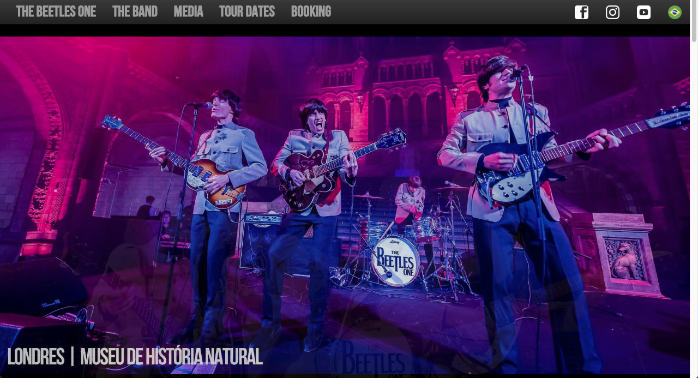

# Beatles1

OVERVIEW
--------------------------------------------------
The purpose of this project was to implement a responsive design and static website that could serve as an online portfolio for a Beatles tribute band. The website had too be fast so it could match Google Search Engine Optimization's standards.

Link: www.beetlesone.com

LANGUAGES AND FRAMEWORKS
--------------------------------------------------
* HTML5, CSS, Javascript
* Twitter Bootstrap for Responsive Design
* RequireJS for assyncronous module script loading

* All images have been compressed and the web server configuration file also make use of gzip compression.

PERFORMANCE
--------------------------------------------------
* The website has pagespeed score A (91%) on gtmetrix performance report.
* The website has been tested on different platforms through a User-Agent Switcher, therefore it works on different browsers and devices.